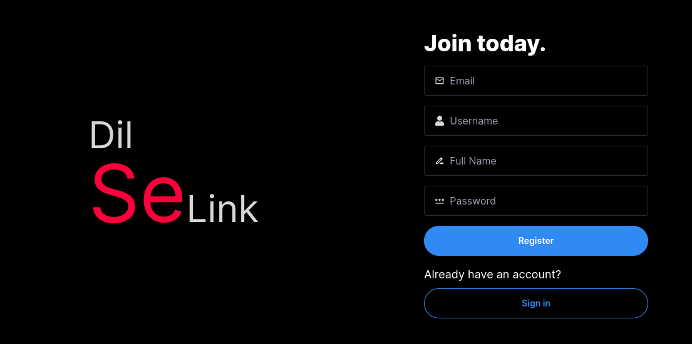
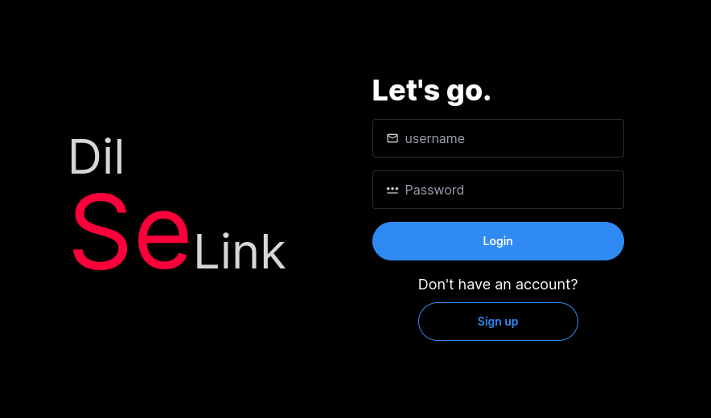
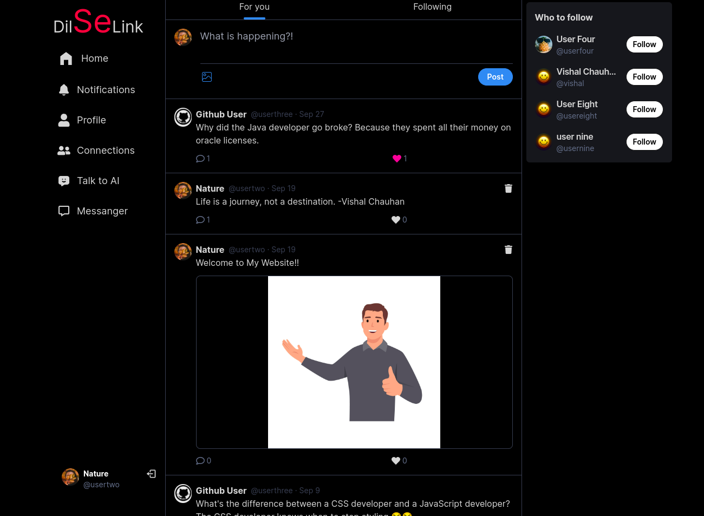
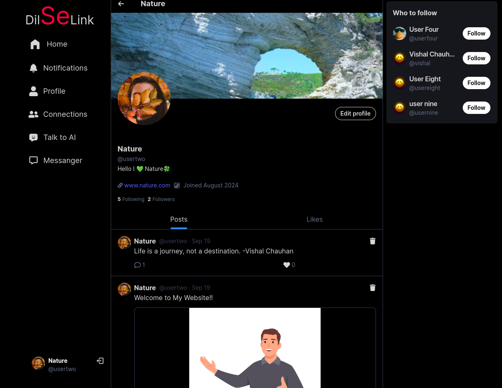
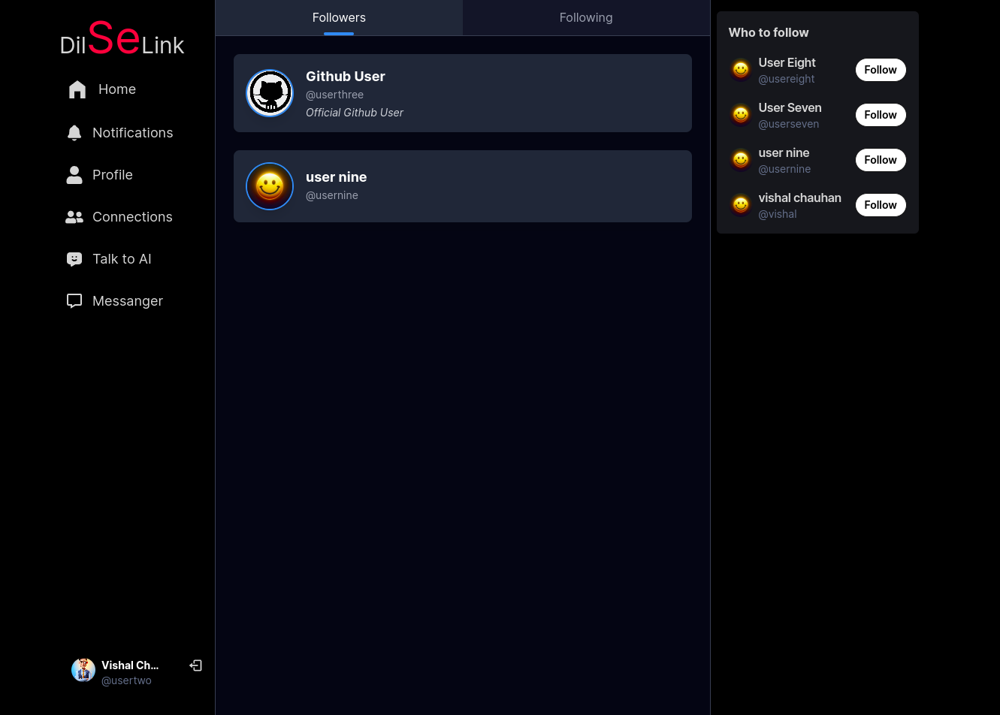
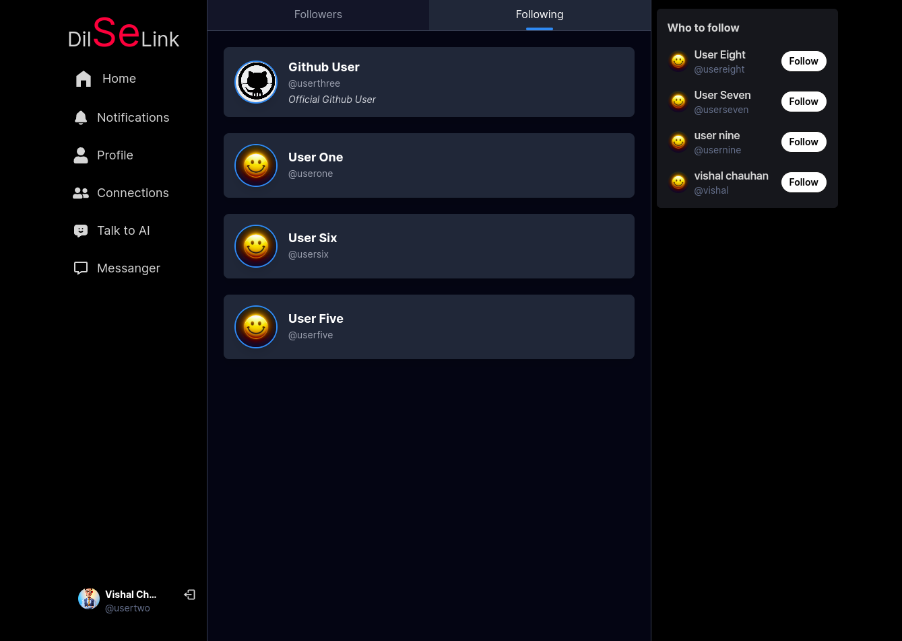
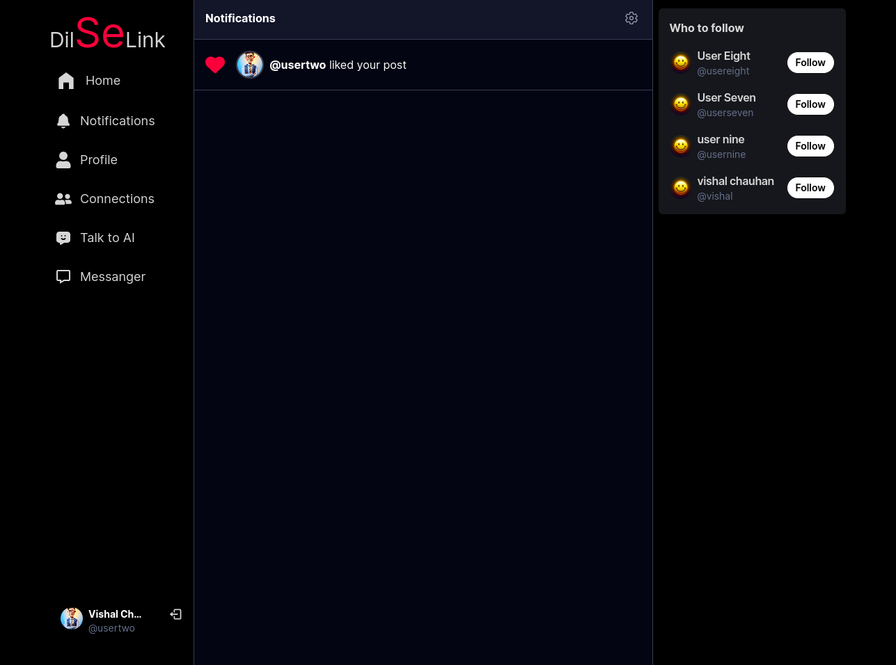
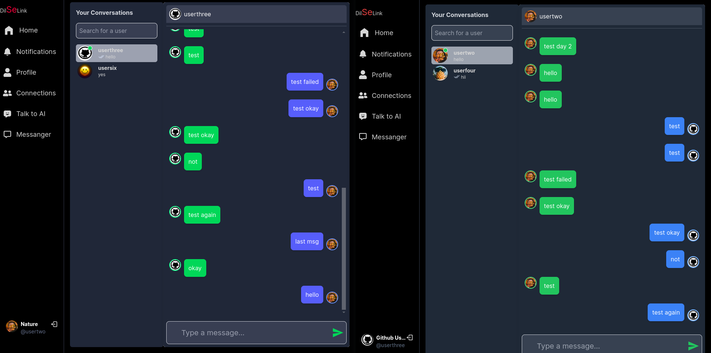
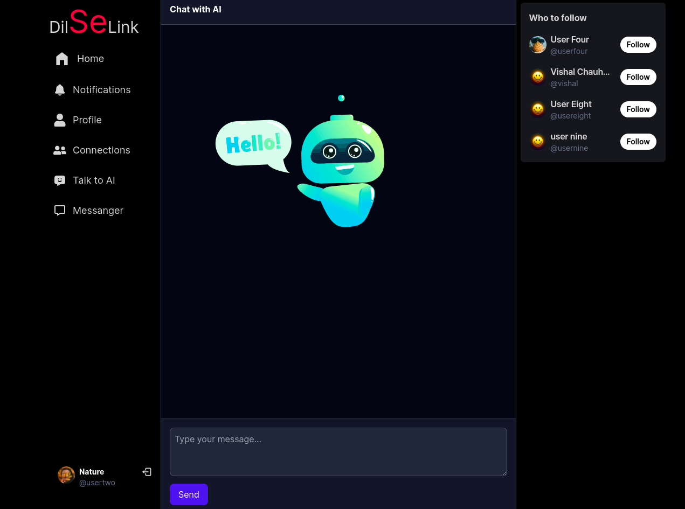
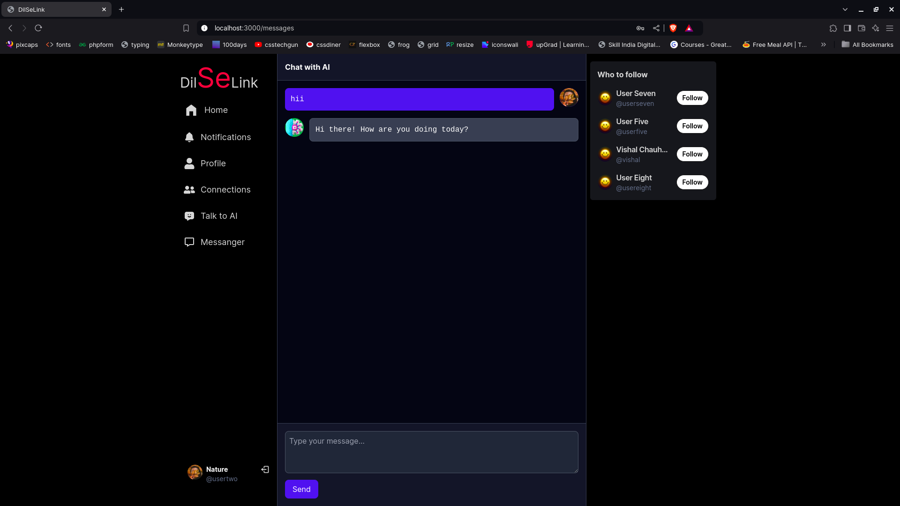

# Social Media Web Application

## 📖 Introduction
This is a modern social media web application that allows users to connect, communicate, and share content. It includes features like real-time messaging, user profiles, and AI-powered assistance.

---

## 🎯 Features
- Real-time messaging between users.
- Follow/unfollow functionality to stay updated with other users.
- AI-powered chatbot for queries.
- User profile customization.

---

## 🛠️ Technologies Used
### Frontend:
- React.js
- Tanstack Query
- Tailwind CSS
- DaisyUI

### Backend:
- Node.js
- Express.js
- MongoDB

### Additional Tools:
- JWT for authentication
- Cloudinary for image storage
- Socket.io for real-time communication
- Postman for API testing

---

## 📸 Screenshots

### Register:


### Login:


### Homepage:


### User Profile:


### Followers:


### Following:


### Notifications:


### Real-time Messaging:


### AI Chatbot:


### Ai Chatbot:

---

## 🚀 How to Run the Project
1. Clone the repository:
   ```bash
   git clone https://github.com/Chauhanvishal01/DILSELINK.git
   ```
2. Navigate to the project directory:
   ```bash
   cd DILSELINK
   ```
3. Install dependencies for both frontend and backend:
   ```bash
   cd frontend
   npm install
   For Backend(in root folder)
   npm install
   ```
4. Start the development servers:
   - Frontend:
     ```bash
     npm run dev
     ```
   - Backend:
     ```bash
     npm run dev
     ```
5. Open the app in your browser at `http://localhost:3000`.

---

## 🌟 Future Enhancements
- Adding a news feed feature.
- Privacy controls for user content.
- Implementing a share feature.

---

## 📝 Conclusion
This project demonstrates the development of a social media platform with essential features for real-time interaction and user engagement. Future updates will focus on enhancing user experience and security.

---
